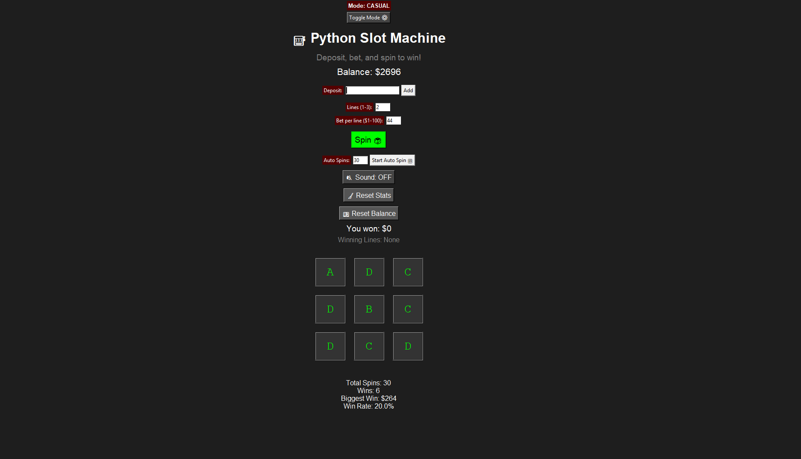

# 🎰 Python Slot Machine Game (GUI)

A desktop-based slot machine game built with Python and Tkinter. Complete with spin animations, sound effects, stat tracking, and a hardcore mode that disables resets for a true challenge.

---

## 🧠 Features

- 🎮 GUI-based slot machine using Tkinter  
- 🔊 Sound effects for spin and wins  
- 🧾 Save/load system for stats and balance (stored in JSON)  
- 🔁 Auto-spin mode with adjustable rounds  
- 🧹 Stat & balance reset buttons  
- 🛡️ **Hardcore Mode** — disables all reset functionality  
- 🎨 Themed UI with red alert visuals for hardcore mode  

## 📸 Preview

